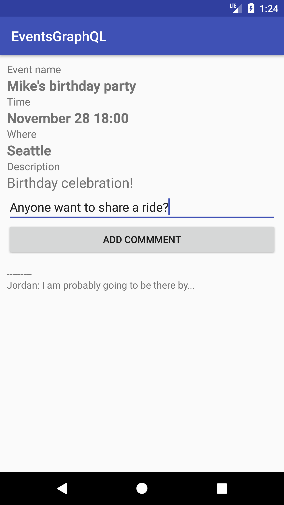

AWS Mobile App Sync Starter App for Android

# Introduction

This is a Starter application for using the Sample app in the AWS AppSync console when building your GraphQL API. The Sample app creates a GraphQL schema and provisions Amazon DynamoDB resources, then connects them appropriately with Resolvers. The application demonstrates GraphQL Mutations, Queries, and Offline support using AWS AppSync. You can use this for learning purposes or adapt either the application or the GraphQL Schema to meet your needs.

</img>

## Features

- GraphQL Mutations
  - Create new events
  - Create comments on existing events
- GraphQL Queries
  - Get all events
  - Get an event by Id
- Authorization
  - The app uses API Key as the authorization mechanism

## AWS Setup

1. Navigate to the AWS AppSync console using the URL: http://console.aws.amazon.com/appsync/home

2. Click on `Create API` and select the `Event App` under the `sample project` in the bottom pane, and select `Start`. Enter a API name of your choice. Click `Create`.

## Android Setup

1. Clone this repository:

	```
	git clone https://github.com/aws-samples/aws-mobile-appsync-events-starter-android.git
	```

2. Open Android Studio, choose `Import project` navigate to the repository folder that was cloned and select open.

3. Ensure that the project's `build.gradle` has the following dependency in the build script:

```bash
    classpath 'com.amazonaws:aws-android-sdk-appsync-gradle-plugin:2.7.+'
```

4. Ensure that the app's build.gradle has the appsync plugin and dependencies on the appsync and paho libraries. For example:

```bash
    apply plugin: 'com.android.application'
    apply plugin: 'com.amazonaws.appsync'
    android {
        // Typical items
    }
    dependencies {
        // Typical dependencies
        implementation 'com.amazonaws:aws-android-sdk-appsync:2.7.+'
        implementation 'org.eclipse.paho:org.eclipse.paho.client.mqttv3:1.2.0'
        implementation 'org.eclipse.paho:org.eclipse.paho.android.service:1.1.1'
    }
```

5. Ensure that the AndroidManifest.xml has the appropriate permissions setup and has the calls and offline state. Also, add a `<service>` entry under `<application>` for `MqttService` to use subscriptions:

```xml
    <uses-permission android:name="android.permission.INTERNET"/>
    <uses-permission android:name="android.permission.ACCESS_NETWORK_STATE"/>
    <uses-permission android:name="android.permission.WAKE_LOCK" />
    <uses-permission android:name="android.permission.READ_PHONE_STATE" />
    <uses-permission android:name="android.permission.WRITE_EXTERNAL_STORAGE"/>
    <uses-permission android:name="android.permission.READ_EXTERNAL_STORAGE"/>

            <!--other config-->

        <application>

            <service android:name="org.eclipse.paho.android.service.MqttService" />

            <!--other config-->
        </application>
```


6. Inside Android Studio, choose the menu `Tools > Android > Sync Project with Gradle Files` to ensure gradle is up to date and wait until this completes.

7. Wait until the progress bar at the top has completed deploying your resources. Then from the integration page of your GraphQL API (you can click the name you entered in the left hand navigation). 

On this same page, select `Android` at the bottom to download your `awsconfiguration.json` configuration file by clicking the **Download Config** button. Replace the `awsconfiguration.json` file in the `src/main/res/raw` folder of your app with the file you just downloaded.

## Application walkthrough

### Generated code

Java code is generated from a schema file (`./app/src/main/graphql/com/amazonaws/demo/appsync/schema.json`) and a .graphql file (`/app/src/main/graphql/com/amazonaws/demo/appsync/events.graphql`) based on your API. The generated source is in the `./app/build/generated/source/appsync` folder of this project after a build is completed.

If you update your schema in the future, you should use the [AWS Amplify CLI](https://aws-amplify.github.io/) codegen feature to automatically download and update your queries, mutations, subscriptions and the schema. For a tutorial of this, [click here](https://github.com/aws-amplify/amplify-cli/blob/master/native_guide.md).

### ListEventsActivity.java (Query)

- The `ListEventsActivity.java` file lists all the events accessible to the user. It returns data from the offline cache first if available and later fetches it from remote to update the local cache.

### ViewEventActivity.java (Mutation, Query, Subscription)

- The `ViewEventActivity.java` file lists information about an event and allows new comments to be added. New comments to the event are added while the user is viewing the event via subscriptions.

### AddEventActivity.java (Mutation)

- The `AddEventActivity.java` file creates a new event using the details entered on screen.

## Getting Help

We use [AppSync Android SDK GitHub issues](https://github.com/awslabs/aws-mobile-appsync-sdk-android/issues) for tracking questions, bugs, and feature requests.

## License

This sample code is made available under the MIT-0 license. See the LICENSE file.
